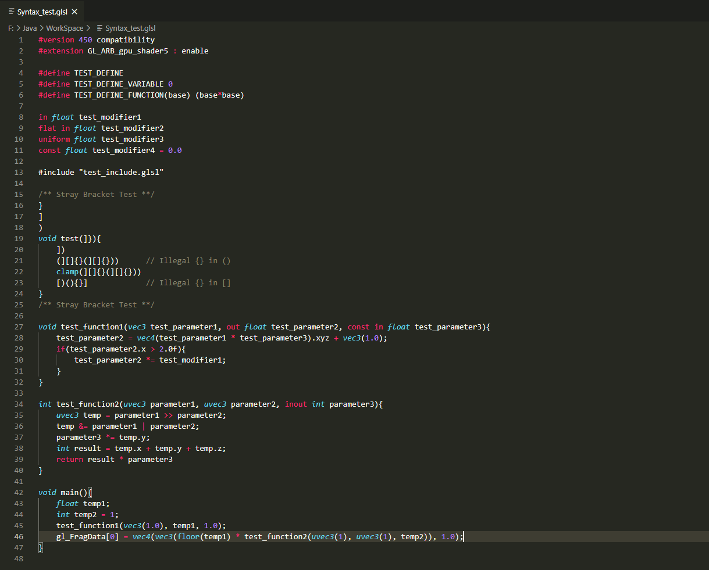
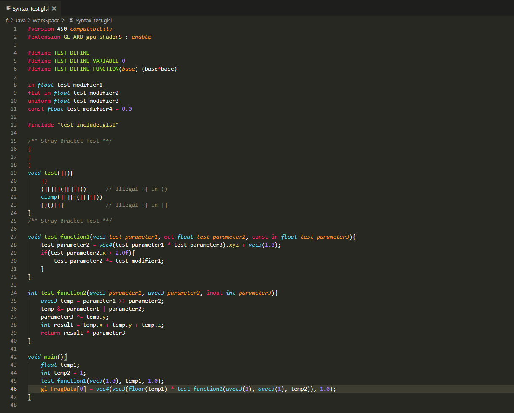

# GLSL Syntax for VS Code

## vscode-glsl

vscode-glsl is a light weighted GLSL (OpenGL Shading Language) syntax highlighting extension for Visual Studio Code. 

This extension is designed to provide a better syntax for GLSL, and uses lots of expressions form [euler0's sublime-glsl](https://github.com/euler0/sublime-glsl), a GLSL syntax package for Sublime Text3, provides almost the best GLSL syntax I have ever seen.

## Features

 - Syntax highlighting for `GLSL`.

 - Some syntax for Minecraft shaderpacks (eg. DRAWBUFFERS output).

## Syntax

### A popular shader language syntax extension in marketplace (extension version 1.1.5):

### Syntex provided by this extension:

## 
